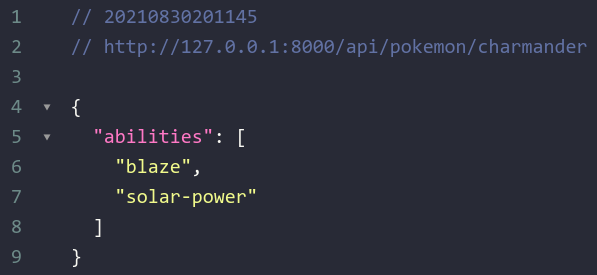

<h1 align="center">
    
</h1>

<h2 align="center">
  Get PokéAPI
</h2>

<p align="center">
 

  
</p>

<p align="center">
  <a href="#-tecnologias">Tecnologias</a>&nbsp;&nbsp;&nbsp;|&nbsp;&nbsp;&nbsp;
  <a href="#-projeto">Projeto</a>&nbsp;&nbsp;&nbsp;|&nbsp;&nbsp;&nbsp;
  <a href="#instalação">Instalação</a>
</p>


## 🚀 Tecnologias

Esse projeto foi desenvolvido com as seguintes tecnologias:

- [Django](https://www.djangoproject.com/)

## 💻 Projeto
**Pequeno projeto para listar as habilidades de um pokémon consumindo a PokéAPI**


## Instalação
### Pré requisitos
Ter instalado:
- [Python](https://www.python.org/downloads/)


#### No terminal, rodar
```sh
# Clonar esse reposiório
git clone https://github.com/andre23arruda/get-pokeapi

# Entrar na pasta dos arquivos do backend
cd get-pokeapi

# Criar um ambiente virtual
python -m venv venv
# ou
python3 -m venv venv

# Ativar o ambiente virtual
. activate.sh

# Instalar os pacotes necessários
pip install -r requirements.txt

# Rodar backend
. run.sh
```

## Após rodar, cole em seu navegador ou user um cliente para fazer requisições (Postman):
```
http://127.0.0.1:8000/api/pokemon/charmander
```
<h1 align="center">
    
</h1>
